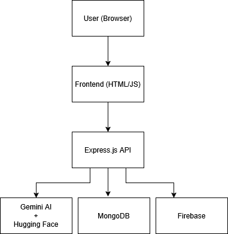

# Student Tutor – AI-Powered Learning Assistant

Student Tutor is a full-stack AI-powered web application designed to help students understand academic documents by generating summaries, quizzes (QCM), and personalized study roadmaps.

This project was developed as part of a **Projet de Fin d’Année (PFA)** and focuses on **practical AI integration**, **backend system design**, and **real-world application architecture**.

---

## Problem Statement

Students often struggle to efficiently understand large or complex study materials. Manual summarization and revision are time-consuming and ineffective.

Student Tutor addresses this problem by using AI models to **extract meaning**, **structure learning paths**, and **actively test understanding** through generated quizzes.

---

## Key Features

- 📄 Upload documents (PDF, text, images)
- 🧠 AI-powered content understanding
- ✍️ Automatic summaries
- ❓ Multiple-choice quiz (QCM) generation
- 🗺️ Personalized study roadmaps
- 🔁 Dynamic quiz regeneration
- 👤 Secure user authentication (Firebase)
- 💾 Save and view AI-generated history
- 🌍 Multi-language support (auto-detected)

---
## Screenshots

### Authentication & Entry

### AI Document Processing

### AI OUTPUT

---
## System Architecture

**High-level flow:**
1. User uploads a document
2. Backend extracts and chunks content
3. AI routing selects the appropriate model (Gemini / Hugging Face)
4. Results are validated and structured
5. Output is returned to the user and optionally stored

---

## Tech Stack

### Backend
- Node.js
- Express.js
- MongoDB Atlas
- Firebase Authentication
- Gemini AI
- Hugging Face Transformers

### Frontend
- HTML
- CSS
- Vanilla JavaScript

---

## My Role & Learnings

I designed and implemented the backend architecture, integrated multiple AI APIs, and handled authentication and data persistence.

Key learnings include:
- Designing AI-assisted pipelines for real-world usage
- Handling unstructured document data
- Backend security and user management
- Practical API integration and system reliability

---

## 🚀 Future Improvements

- Improve frontend UI/UX
- Add support for more document formats
- Optimize chunking and AI cost management
- Add progress tracking for students

---

## 👤 Author

**Mohamed Chaibi**  
Computer Science Student  
Interested in AI systems, backend engineering, and system-level optimization
